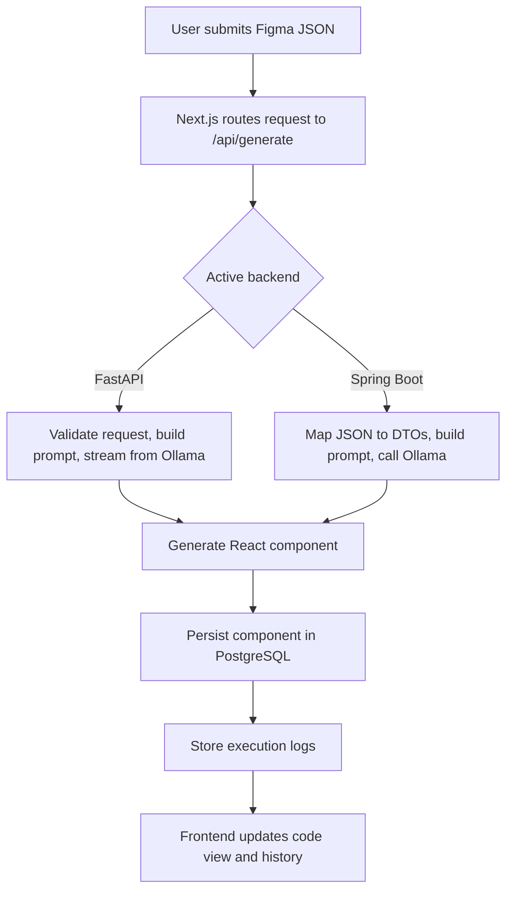

# Figma-to-React Copilot (AgentHub Architecture)

An AI-powered copilot that automates the generation of production-ready React components directly from Figma design data. The project demonstrates a modern microservice architecture featuring interchangeable backend implementations (FastAPI and Spring Boot), a Next.js frontend, local LLM inference through Ollama, and PostgreSQL storage hosted on Supabase.

Designed as both a learning platform and an enterprise-style architecture showcase, the project emphasizes scalability, maintainability, and clean separation of responsibilities.

# Table of Contents

- [Overview](#overview)
- [System Architecture](#system-architecture)
- [Core Components](#core-components)
- [Features](#features)
- [API Architecture](#api-architecture)
- [Logical Workflow](#logical-workflow)
- [Database](#database)
- [Environment Variables](#environment-variables)
- [Local Installation](#local-installation)
- [Docker Deployment](#docker-deployment)
- [Networking Notes](#networking-notes)

# Overview

The application transforms Figma layouts into React (`.tsx`) components using local Large Language Models running through Ollama.

The architecture intentionally separates concerns into three independent services:

- **Next.js** frontend for the user interface.
- **FastAPI** backend optimized for asynchronous AI inference.
- **Spring Boot** backend focused on enterprise-grade persistence and structured business logic.

Both backend implementations expose the exact same REST API contract, allowing the frontend to switch between them without any code changes.

# System Architecture

```
                  ┌────────────────────────────────────────┐
                  │       Main Workspace Interface         │
                  │             (Next.js)                  │
                  └──────────────────┬─────────────────────┘
                                     │
                         ┌───────────┴───────────┐
                         │      Ollama Engine    │
                         │  qwen2.5-coder:7b     │
                         └───────────┬───────────┘
                                     │
                        /api/* Internal Rewrites
                                     │
            ┌────────────────────────┴────────────────────────┐
            ▼                                                 ▼
┌───────────────────────┐                         ┌───────────────────────┐
│ High-Performance AI   │                         │ Enterprise Data Layer │
│ Proxy (FastAPI)       │                         │ (Spring Boot)         │
└───────────┬───────────┘                         └───────────┬───────────┘
            │                                                 │
     Async SQLAlchemy                                 JDBC / Spring Data
            │                                                 │
            ▼                                                 ▼
┌───────────────────────┐                         ┌───────────────────────┐
│ Supabase Pooler       │                         │ Supabase PostgreSQL   │
│ (Port 6543)           │                         │ (Port 5432)           │
└───────────────────────┘                         └───────────────────────┘
```

# Core Components

## Next.js Frontend

The frontend acts as the application's command center.

Responsibilities include:

- Component generation interface
- Live preview panels
- Workspace management
- API proxy through Next.js rewrites
- Code visualization
- History browsing

Instead of communicating directly with backend servers, every request goes through:

```
/api/*
```

This abstraction completely hides backend URLs from the client, making backend swapping seamless.

## FastAPI Backend

The Python backend is optimized for AI workloads and asynchronous processing.

Main responsibilities:

- Prompt construction
- Ollama communication
- Async request handling
- Context management
- Streaming LLM responses
- Database persistence using SQLAlchemy Async

Technology stack:

- FastAPI
- SQLAlchemy Async
- asyncpg
- Pydantic
- Ollama API

## Spring Boot Backend

The Java backend demonstrates an enterprise-oriented architecture.

Responsibilities include:

- Persistent workflow management
- Agent metadata
- Business logic
- Database management
- Analytics
- MCP-compatible architecture

Technology stack:

- Spring Boot
- Spring Data JPA
- Hibernate
- PostgreSQL
- Maven

# Features

## AI Code Generation

Automatically converts Figma component layouts into production-ready React components.

## Figma-to-Code Compilation

Parses:

- Layout hierarchy
- Typography
- Colors
- Design tokens
- Spacing
- Component metadata

and generates clean `.tsx` React code.

## Component Workspace

Generated components are automatically stored inside PostgreSQL.

Each component includes:

- Name
- Source code
- Creation timestamp
- Metadata

## Generation History

Every execution is logged.

Tracked information includes:

- Execution duration
- Generated component
- Errors
- Model used
- Token statistics

## Dual Backend Architecture

The frontend can transparently switch between:

- FastAPI
- Spring Boot

without changing any frontend code.

## Local LLM Execution

Runs entirely locally using Ollama.

Advantages:

- No API costs
- Privacy
- Offline usage
- Faster iteration

## Transaction Connection Pooling

Supports Supabase's transaction pooler while avoiding prepared statement conflicts.

# API Architecture

Both backend implementations expose the exact same REST API.

| Method | Endpoint               | Description                         |
| ------ | ---------------------- | ----------------------------------- |
| POST   | `/api/generate`        | Generate React code from Figma data |
| GET    | `/api/components`      | List generated components           |
| GET    | `/api/components/{id}` | Retrieve one component              |
| DELETE | `/api/components/{id}` | Delete a component                  |
| GET    | `/api/logs`            | Retrieve execution logs             |
| GET    | `/api/analytics/stats` | Aggregate project statistics        |

Because both implementations respect the same API contract, the frontend never needs to know which backend is active.

---

## Logical Workflow



### Step-by-step

1. User Submission  
   The user sends a Figma JSON payload.

2. Next.js Routing  
   The request is forwarded to `/api/generate`.

3. Active Backend  
   The selected backend handles validation, prompt building, and Ollama communication.

4. Ollama  
   Generates the React component code.

5. Persistence  
   The generated component is saved to PostgreSQL.

6. Logging  
   Execution metrics are recorded for auditing.

7. Frontend  
   The UI displays the generated code and updates history.

# Database

The application stores information inside Supabase PostgreSQL.

## Components Table

Stores generated React components.

Suggested fields:

| Column     | Type          |
| ---------- | ------------- |
| id         | UUID / SERIAL |
| name       | VARCHAR       |
| code       | TEXT          |
| created_at | TIMESTAMP     |

## Logs Table

Stores execution telemetry.

Typical information:

- Model name
- Generation duration
- Errors
- Token usage
- Timestamp

# Environment Variables

# Configuration

Each backend follows the configuration conventions of its respective framework.

## FastAPI

The FastAPI backend reads its configuration from a standard `.env` file located in the backend root directory.

This includes:

- Database connection URL
- Ollama host
- LLM model name
- API keys
- Service ports
- Other environment-specific variables

Example:

```env
DATABASE_URL=...
OLLAMA_HOST=http://host.docker.internal:11434
MODEL_NAME=qwen2.5-coder:7b
OPENAI_API_KEY=YOUR_API_KEY
PORT=8080
```

## Spring Boot

The Spring Boot backend uses Spring Profiles.

For local development, configuration is stored in:

```
backend-springboot/src/main/resources/application-local.yml
```

Typical settings include:

- PostgreSQL credentials
- External API keys
- Service URLs
- JPA/Hibernate configuration
- Logging settings
- Spring profile configuration

The application is started using the local profile:

```bash
./mvnw spring-boot:run "-Dspring-boot.run.profiles=local"
```

This separation keeps sensitive credentials outside the codebase while allowing different configurations for local development, testing, and production deployments.

# Local Installation

## 1. Install Ollama

Expose the local daemon.

Download and run the desired model with :

```bash
$env:OLLAMA_HOST="127.0.0.1:11434"; ollama run qwen2.5-coder:7b
```

## 2. Start the Backend

### FastAPI

```bash
cd backend-fastapi

uvicorn app.main:app --reload --port 8000
```

### Spring Boot

```bash
cd backend-springboot

./mvnw spring-boot:run "-Dspring-boot.run.profiles=local"
```

## 3. Start Frontend

```bash
cd frontend

npm install

npm run dev
```

Open:

```
http://localhost:3000
```

# Docker Deployment

The project supports multiple Docker Compose profiles.

## FastAPI Deployment

```bash
docker compose up --profile fastapi
```

## Spring Boot Deployment

```bash
docker compose up --profile springboot
```

Docker networking automatically resolves service names, allowing internal communication without exposing container IPs.

# Networking Notes

## Docker ↔ Host Communication

Containers access the local Ollama daemon using:

```
http://host.docker.internal:11434
```

instead of:

```
localhost
```

or

```
127.0.0.1
```

## Supabase Pooler

When using Docker, the project connects through Supabase's connection pooler:

```
aws-0-[region].pooler.supabase.com:6543
```

This avoids networking issues while supporting high concurrency.

# Technologies Used

### Frontend

- Next.js
- React
- TypeScript

### Python Backend

- FastAPI
- SQLAlchemy Async
- asyncpg
- Pydantic

### Java Backend

- Spring Boot
- Spring Data JPA
- Hibernate
- Maven

### AI

- Ollama
- qwen2.5-coder
- Local LLM inference

### Database

- PostgreSQL
- Supabase

### DevOps

- Docker
- Docker Compose

# Project Highlights

- Enterprise-inspired microservice architecture
- Interchangeable backend implementations
- Local AI inference with Ollama
- PostgreSQL persistence using Supabase
- Shared REST API contract across services
- Docker-based deployment
- Modern asynchronous Python backend
- Enterprise Java backend
- Production-oriented networking and connection pooling
- Full-stack TypeScript + Python + Java architecture
